# Storage Types

There are two types of board storage:
- User: Only visible to the creator of the board, and are not shareable except by exporting to Account storage.
- Account: Visible and editable by anyone with access to the New Relic Account. Can be shared by linking.

&nbsp;
# Control Bar

## Board Management

### Delete 
>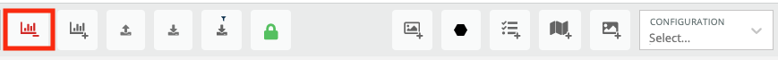
Permanently delete this board.

### Create 
>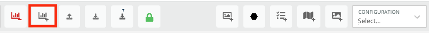
Create a new board in either User or Account space.
 
### Import 
>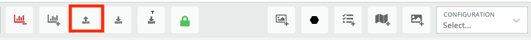
Paste a JSON representation of a board and give it a new name to import it into User or Account space.
 
### Export 
>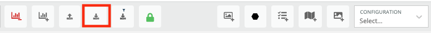
Obtain a JSON representation of this board to import, save into source control, or other uses.

### Export with filters 
>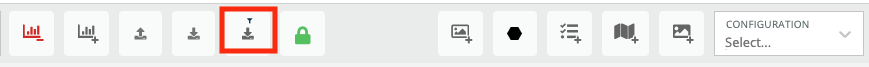
The same as Export, however for board with Filters created it will insert the currently selected filter criteria into each query. The resulting exported board will have no filters itself, but rather transformed queries with the filters applied. For a board with an appName filter set to `myApp`, the transformation would apply like so:

#### Original Query ####
~~~
SELECT average(duration) FROM Transaction TIMESRIES
~~~

#### Exported Board's Query ####
~~~
SELECT average(duration) FROM Transaction WHERE appName = 'myApp' TIMESRIES
~~~
 
### Lock
>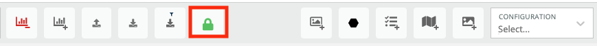
Toggle whether this board is locked, preventing most changes. Locking a board only applies to the current session (it is not a setting shared among users). Newly created or imported boards always start unlocked, but otherwise all boards will load as locked.

&nbsp;

## Board editing
 
### Create Nrql Widget
>
Open interactive editor for creating a new NRQL widget. Useful for searching Metrics, Events, Logs or Traces.

### Create Entity High Density View Widget 
>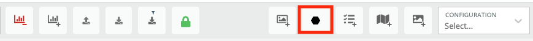
Open editor for creating an entity search widget. Useful for displaying entities, their alerting statuses, and relationships.

### Create Event Timeline Widget
>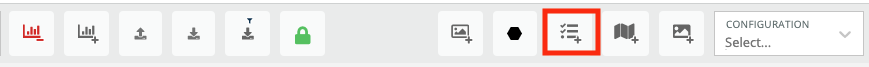
Subscribe to an Event Stream to view events and their descriptions over time.
 
### Create Mapbox Widget 
>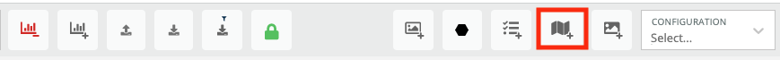
Configure a Mapbox widget to display geographic data from a Geomap.
 
### Create HTML Widget 
>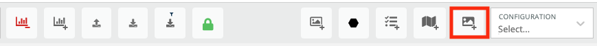
Define a widget with HTML.

&nbsp;

## Board Configuration Dropdown
>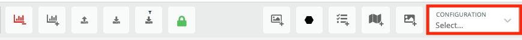

### Filters 
>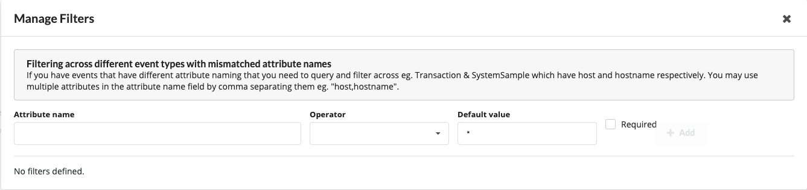
Define filters for this board. An attribute can be given multiple names to match different keys across event types. A board will not render until any `Required` filters have been selected.
 
### CSS Styles 
>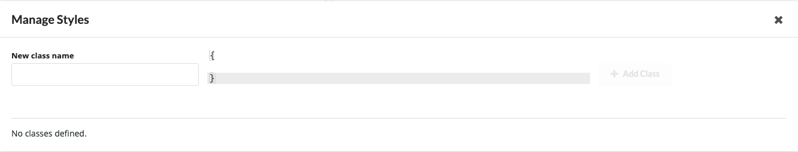
Define CSS for styling widgets.
 
### Manage Event Streams 
>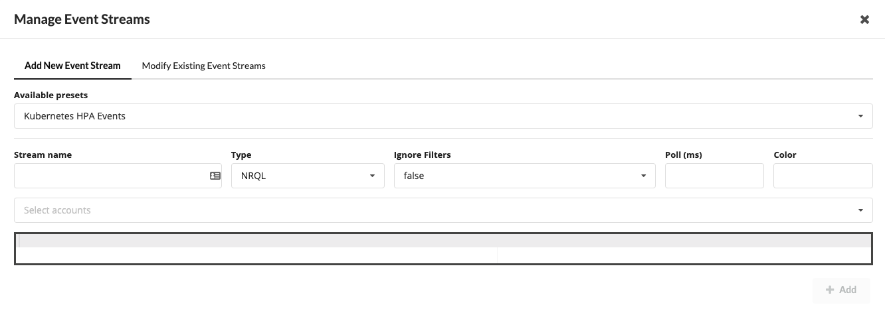
Add or manage existing event streams. Event streams can be overlaid on timeseries widgets to show context of events, or displayed in a timline view.

#### **Available Presets**
Select from predefined event lists, including: AWS Health Events (requires the [AWS Health Integration](https://docs.newrelic.com/docs/integrations/amazon-integrations/aws-integrations-list/aws-health-monitoring-integration)), Kubernetes Events (requires the [Kubernetes Integration](https://docs.newrelic.com/docs/integrations/kubernetes-integration/installation/kubernetes-integration-install-configure)), and Application Deploy and Alert events (requires [APM Deployment Markers](https://docs.newrelic.com/docs/apm/new-relic-apm/maintenance/record-monitor-deployments) and/or [Alerts](https://docs.newrelic.com/docs/alerts-applied-intelligence/new-relic-alerts/get-started/introduction-alerts) set up on APM entities)

#### **Stream Name**
A unique name for this Event Stream.

#### **Type**
Currently NRQL and Entity Search Queries (for graphql) are supported.

#### **Ignore Filters**
Instruct this event stream to ignore the board's filter selection. Ignoring filters can be important when an event stream doesn't share attributes with the rest of the board's event types. For instance, AWS Health events won't have an `appName` on them, so having that stream ignore filters ensures that it will be seen even if a particular board is filtering down on `appName`. However, Kubernetes Event Streams will have attributes such as `clusterName` or `deploymentName` such that if a board is filtering to a specific cluster via `clusterName` the event stream will filter accordingly.

#### **Polling Interval**
Number of milliseconds between polling for this stream.

#### **Color**
Color for this stream: Red, Orange, Yellow, Olive, Green, Teal, Blue, Violet, Purple, Pink, Brown, Grey, Black.

#### **Select Accounts**
For NRQL queries, the accounts to be queried.

#### **Query Text**
The NRQL or Entity Search Query text.

### Manage HTML Widgets 
>

### Manage Geo Maps
>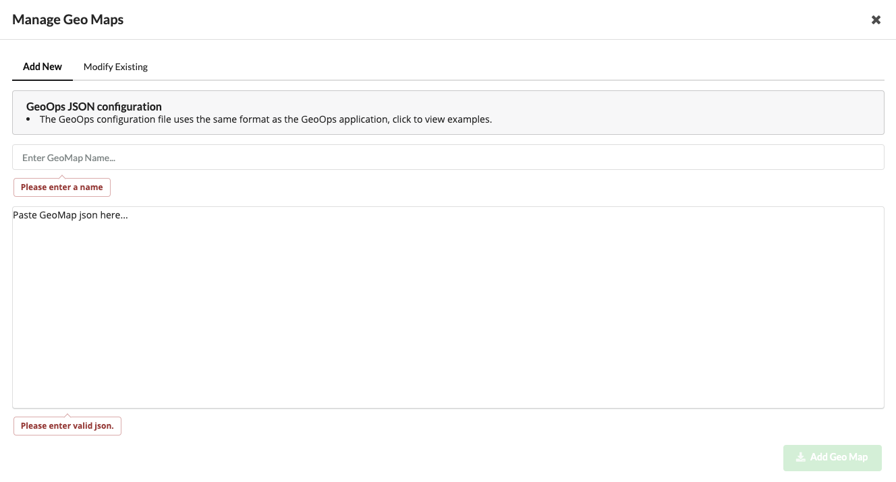

### Manage Geo Maps
>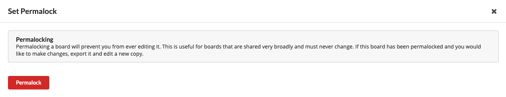
Permanently lock a board, removing all editing capability for all users.

&nbsp;

# Additional Capabilities

## **Defining Custom Event Streams**
Users may define NRQL event streams based on any event in NRDB. Information on how to send custom events into New Relic can be found [here](https://docs.newrelic.com/docs/telemetry-data-platform/ingest-manage-data/ingest-apis/use-event-api-report-custom-events). The Event Stream rendering code will, by default, look for a `message` field on an event. For custom events, simply ensure they have a `message` field and you can use the following syntax to define your event stream query:

~~~
SELECT * FROM MyCustomEvent
~~~

If you are using an event that's already been defined or want to use a different field, simply use NRQL's renaming functionality:

~~~
SELECT desiredAttribute as 'message' FROM MyCustomEvent
~~~
